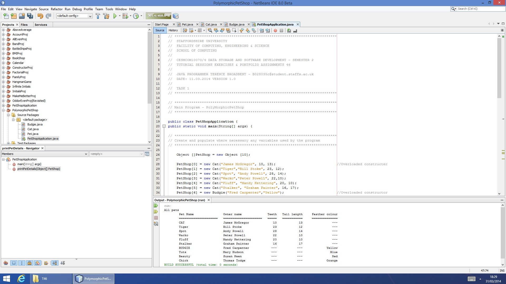

# PETSHOP 2
A pet shop animal/owner relationship utility file using polymorphism.

| LANGUAGE | FILENAME | MD5 Hash |
|------    |------    | -------  |
| Java | PetShopApplication.java | 8abe013d80f58e2a6f8d5eb346ff4aa8 |
| Java | Cat.java | 670b6faa2a164284f1cc586b6c238470 |
| Java | Budgie.java | dfaf836bb724cc5045817bb79d78ea2a | 
| Java | Pet.java | 19f062d92700e7fc3bf11e50003d05a9 | 

- [x] Tested and working...

## CONSOLE DISPLAY

